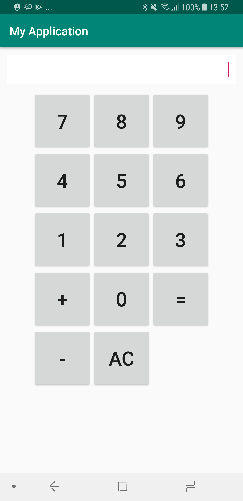

# Домашнее задание по лекции "Проектирование андроид приложений"

Спроектировать калькулятор используя MVVM и Arcitecture Components (ViewModel LiveData). 

Написать юнит тесты на классы CalculatorViewModel и CalculatorModel. 

В качестве заготовки использовать UI из activity_main.xml

#### План работ:
* Нужно написать класс CalculatorModel и в нем инкапусировать всю логику калькулятора. 
* Написать тесты на CalculatorModel
* Далее нужно имплементировать методы в заготовке CalculatorViewModel и использовать там CalculatorModel
* Написать тесты на CalculatorViewModel
* Связать CalculatorActivity (с activity_main.xml)  и CalculatorViewModel

#### Подсказки:


Чтобы тестировать LiveData в CalculatorViewModel и не получать ошибку типа `java.lang.RuntimeException: Method getMainLooper in android.os.Looper not mocked` добавьте зависимость в app/build.gradle

`testImplementation 'android.arch.core:core-testing:1.1.1'`

и затем добавьте Rule в ваш юнит тест:
```java
@Rule
public TestRule rule = new InstantTaskExecutorRule();
```

Чтобы InstantTaskExecutorRule применился до инициализации ViewModel, нужно инициализировать ViewModel в методе Before

```java
    @Before
    public void setup() {
        calculatorViewModel = new CalculatorViewModel();
    }
```



